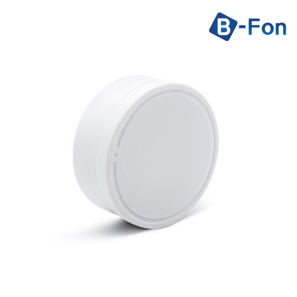
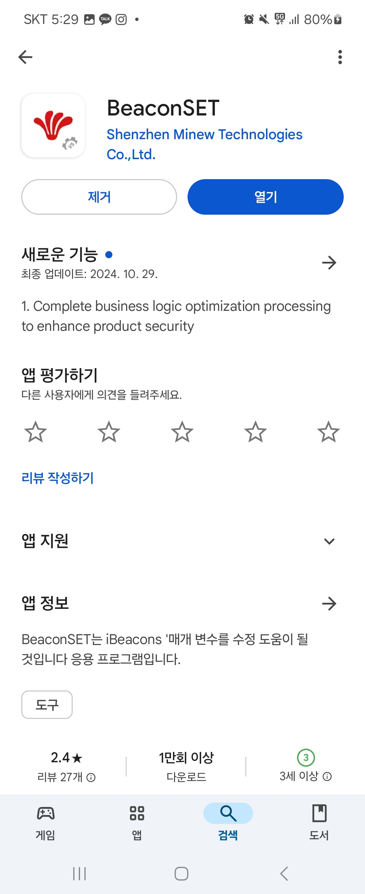
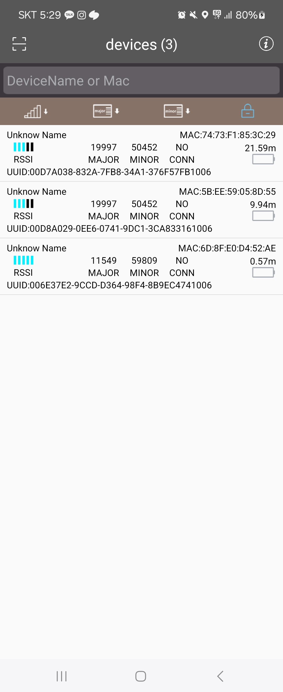

# Beacon
### 구매처
[현승코리아] (https://nowwin.co.kr/product/%EB%B9%84%EC%BD%98-beacon-ibeacon-%EC%B6%9C%EA%B2%B0%EA%B4%80%EB%A6%AC-%EB%B8%94%EB%A3%A8%ED%88%AC%EC%8A%A4-e7-%EB%B9%84%ED%8F%B0-beafon/360/category/116/display/1/)

비콘 beacon iBeacon 출결관리 블루투스 E7 비폰 BeaFo 제품

# Beacon 설정법
### 비콘 설정 어플
|
---| ---|

BeacoSET 어플리케이션을 다운받은 후, 설정을 변경하고 싶은 Beacon을 인식하여 설정을 변경하면 됨

### 비콘 정보

    PW: snueco00
    + 비콘이름은 MB2_B1, SB2_B1 이런식으로 층수별로 하나씩 부여
     * 38동 메인입구_엘리베이터 3대 -> Main
     * 38동 서브입구_화물엘리베이터 1대 -> Sub
    + low 송출 모드 2m 내에서 인식
    + 배터리 수명은 1년 정도 (2024년 10월 경에 교체해두었음)
    + 배터리 가격은 2천원 정도 (비콘의 대부분을 차지하고 있는 은색 코인 배터리)

### 비콘 이름별 MAC 주소

|이름|MAC Address|
|:---:|:---:|
|MB2_B1|C300001C6BB9|
|MB1_1|AC233FF6B922|
|M1_2|AC233FF6BCDF|
|M2_3|AC233FF6BCD4|
|M3_4|AC233FF6BE46|
|M4_5|AC233FF6BE44|
|SB2_B1|AC233FF6BCCF|
|SB1_1|C300001C6BC6|
|S1_2|AC233FF6BCCE|
|S2_3|C300001C6BB8|
|S3_4|C300001C6BC4|
|S4_5|C300001C6BBA|

# Beacon 사용을 위한 설치 파일

###  사용자 계단 사용 추적

  * 어플 사용 매커니즘
  * 비콘 사용 설명
  * 코드 구성 및 설명
  * flutter package download
